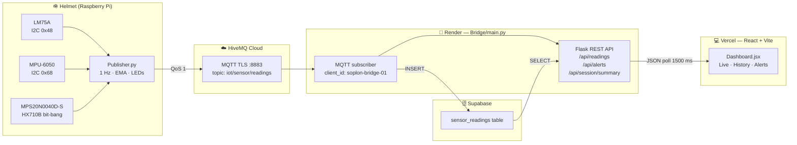

# Soplón — IoT Aerodynamic Cycling Helmet

> Real-time posture, wind, and safety monitoring for cyclists — from sensor to dashboard.


---

## Overview

Soplón is an end-to-end IoT system embedded in a cycling helmet that monitors three
things in real time: **rider posture** (pitch + roll), **wind conditions** (dynamic
pressure → speed), and **ambient temperature**. Data flows from a Raspberry Pi at
1 Hz through HiveMQ Cloud via MQTT/TLS, through a Flask bridge on Render, into a
Supabase table, and finally into a React dashboard on Vercel that supports both a
live view for coaches and a post-session replay for analysis.

Three GPIO LEDs on the helmet give the rider immediate feedback without needing to
look at a screen:

| LED color | Meaning |
|-----------|---------|
| 🔴 Red | Bad posture — correct head angle |
| 🟢 Green | Wind is favorable — safe to overtake |
| 🟡 Yellow | Cross-wind warning — ride with caution |

---

## Features

- **Posture detection** — pitch and roll computed from MPU-6050 accelerometer via
  `atan2`; configurable upper/lower limits per axis
- **Wind speed** — Bernoulli inversion of dynamic pressure from MPS20N0040D-S:
  `v = sqrt(2 · Pa / ρ)`, converted to km/h; air density tuned for Bogotá (~1.0 kg/m³ at 2600 m)
- **Cross-wind estimation** — roll angle used as a proxy for lateral wind component;
  triggers warning above configurable threshold
- **Fall detection** — total acceleration magnitude exceeding `FALL_ACCEL_THRESHOLD`
  (default 3 g) confirmed over N consecutive cycles
- **EMA filtering** — exponential moving average on pressure and temperature to
  suppress sensor noise
- **Live dashboard** — sliding 2-minute window of pitch/roll and wind charts,
  posture gauges, and alert feed
- **Session replay** — full-route posture timeline, alert distribution bar chart,
  temperature and wind area charts, summary stats (% posture OK, max wind, falls)
- **Alert taxonomy** — `HEAD_TOO_HIGH`, `HEAD_TOO_LOW`, `LEAN_LEFT`, `LEAN_RIGHT`,
  `CROSSWIND_WARNING`, `FALL_DETECTED`

---

## Architecture



---

## Sensors

| Sensor | Interface | I²C address / pins | Measurement | Notes |
|--------|-----------|---------------------|-------------|-------|
| LM75A | I²C | `0x48` | Ambient temperature (°C) | EMA filtered |
| MPU-6050 | I²C | `0x68` | Accel (m/s²) + Gyro (°/s) | Range: ±4 g / ±500 °/s |
| MPS20N0040D-S | HX710B bit-bang | SCK `GPIO5`, DOUT `GPIO6` | Differential pressure (Pa) → wind speed (km/h) | FS ~40 kPa / 2²³ counts |

---

## Stack by layer

| Layer | Technology | Hosting |
|-------|-----------|---------|
| Firmware | Python 3, `paho-mqtt` ≥2.0, `smbus2`, `mpu6050`, `RPi.GPIO` | Raspberry Pi (helmet) |
| Message broker | HiveMQ Cloud — TLS port 8883 | HiveMQ managed cloud |
| Bridge / API | Flask, `flask-cors`, `supabase-py`, `paho-mqtt` | Render (free tier) |
| Database | Supabase (PostgreSQL) | Supabase managed |
| Frontend | React 18, Vite, Recharts, Clerk auth, `react-router-dom` | Vercel |

---

## Repository structure

```
soplon/
├── Publisher.py          # Raspberry Pi firmware — reads sensors, computes
│                         # posture/wind/alerts, controls LEDs, publishes MQTT
├── Bridge/
│   ├── main.py           # MQTT subscriber + Flask REST API + Supabase inserts
│   ├── requirements.txt  # paho-mqtt, flask, flask-cors, supabase, python-dotenv
│   ├── test_publish.py   # Manual test publisher for local debugging
│   └── Procfile          # Render process definition: `python Bridge/main.py`
└── frontend/
    ├── src/
    │   ├── App.jsx              # Router + ClerkProvider
    │   ├── components/
    │   │   ├── Navbar.jsx       # Nav + Clerk UserButton
    │   │   └── ProtectedRoute.jsx
    │   └── pages/
    │       ├── Dashboard.jsx    # Live + History tabs, charts, alert feed
    │       ├── Home.jsx
    │       ├── SignInPage.jsx
    │       └── SignUpPage.jsx
    ├── .env.production          # VITE_BRIDGE_URL=[render url]
    ├── vite.config.js
    └── package.json
```

---

## Setup

### 1. Supabase — `sensor_readings` table

```sql
create table sensor_readings (
  id              bigserial primary key,
  device_id       text,
  timestamp       timestamptz,
  temperature_c   float,
  temperature     float,          -- v1 alias, kept for back-compat
  pitch_deg       float,
  roll_deg        float,
  posture_ok      boolean,
  posture_alert   text,
  wind_speed_kmh  float,
  wind_dynamic_pa float,
  wind_status     text,
  pressure        float,          -- v1 alias
  accel_x         float,
  accel_y         float,
  accel_z         float,
  gyro_x          float,
  gyro_y          float,
  gyro_z          float,
  fall_detected   boolean default false,
  alerts          text default '[]'
);
```

### 2. Publisher — `Publisher.env`

```env
# MQTT
MQTT_BROKER=<your-hivemq-cluster>.hivemq.cloud
MQTT_PORT=8883
MQTT_TOPIC=<your/mqtt/topic>
MQTT_USER=<your-mqtt-user>
MQTT_PASS=<your-mqtt-password>
MQTT_CA_CERT=                    # leave blank to use system CAs (HiveMQ Cloud)
DEVICE_ID=soplon-helmet-01

# Publish rate
PUBLISH_INTERVAL_S=1.0

# GPIO pins (BCM)
PIN_LED_POSTURE=17
PIN_LED_OVERTAKE=27
PIN_LED_CROSSWIND=22
PIN_HX710B_SCK=5
PIN_HX710B_DOUT=6

# Posture thresholds (degrees)
PITCH_MAX_DEG=20
PITCH_MIN_DEG=-15
ROLL_MAX_DEG=15

# Wind thresholds (km/h)
WIND_FAVORABLE_KMH=10
WIND_CROSSWIND_KMH=25

# Physics — Bogotá ~2600 m ASL
AIR_DENSITY=1.0

# Pressure sensor calibration
PRESSURE_OFFSET=0
PRESSURE_SCALE=1.0

# Fall detection
FALL_ACCEL_THRESHOLD=3.0
FALL_CONFIRM_CYCLES=2

# EMA
EMA_ALPHA=0.2
```

### 3. Bridge — `Bridge/.env`

```env
SUPABASE_URL=https://<project>.supabase.co
SUPABASE_SECRET_KEY=<service-role-key>

MQTT_BROKER=<your-hivemq-cluster>.hivemq.cloud
MQTT_PORT=8883
MQTT_TOPIC=<your/mqtt/topic>
MQTT_USER=<your-mqtt-user>
MQTT_PASSWORD=<your-mqtt-password>

ALLOWED_ORIGIN=<your-vercel-url>
PORT=5000
```

> **Note — Render free tier:** Render sleeps free-tier web services after 15 minutes
> of HTTP inactivity, killing the persistent MQTT connection. For always-on operation
> consider Railway, Fly.io, or a VPS.

### 4. Frontend — `frontend/.env.production`

```env
VITE_BRIDGE_URL=https://<your-bridge>.onrender.com
```

Run locally:
```bash
cd frontend
npm install
npm run dev
```

### 5. Authentication (Clerk)

Soplón uses Clerk for user auth. **The Clerk instance must be Production** (keys
starting with `pk_live_`), not Development — Development instances use cookies scoped
to `.clerk.accounts.dev` which are blocked cross-site on `.vercel.app` domains,
breaking Google OAuth silently.

Add to Vercel environment variables:
```
VITE_CLERK_PUBLISHABLE_KEY=pk_live_...
```

Clerk Dashboard → Redirects → add to allowed redirect URLs:
```
https://<your-vercel-url>/dashboard
https://<your-vercel-url>/
```

> **Note:** Clerk Production instances require a custom domain — `*.vercel.app` is
> not accepted as an application domain. [POR CONFIRMAR — pending custom domain setup]

---

## Engineering notes

### MQTT client IDs must be unique
HiveMQ Cloud enforces one session per `client_id`. If Publisher and Bridge share the
same ID, the broker disconnects whichever connected first (rc=7 — Not Authorized on
the second). Publisher uses `soplon-helmet-01`, Bridge uses `soplon-bridge-01`.

### paho-mqtt ≥ 2.0 callback API
paho-mqtt 2.0 deprecated the old `Client()` constructor. Use:
```python
mqtt.Client(mqtt.CallbackAPIVersion.VERSION1, client_id=DEVICE_ID)
```

### Wind speed calculation
Dynamic pressure from HX710B is converted to wind speed via Bernoulli:
```
v [m/s] = sqrt(2 · Pa / ρ)
v [km/h] = v [m/s] × 3.6
```
At Bogotá altitude (2600 m ASL), `ρ ≈ 1.0 kg/m³` instead of the sea-level
1.225 kg/m³ — use `AIR_DENSITY=1.0` in `.env` or wind readings will be ~10% low.

### Cross-wind proxy
The helmet has a single pressure port facing forward. True lateral wind is not
directly measured. Instead, roll angle > 8° is used as a proxy: a cyclist leaning
into a side-wind will tilt their head, causing the helmet (and IMU) to roll. This is
an approximation and works best at steady-state; it is unreliable in cornering.

### Supabase `alerts` column
`alerts` is stored as a JSON string (`text` column, e.g. `'["HEAD_TOO_HIGH"]'`)
because the Supabase free-tier client used does not natively map PostgreSQL arrays.
The Bridge's `/api/readings` endpoint parses it back to a JSON array before sending
to the frontend.

### `PGRST204` error
If the Bridge logs `PGRST204`, a column referenced in the INSERT does not exist in
`sensor_readings`. Run the `ALTER TABLE` statements in the Setup section above.

---

## Author

**Juan Pablo Arenas** · Mechatronics Engineering · Pontificia Universidad Javeriana, Bogotá  
GitHub: [@Fellbowl](https://github.com/Fellbowl)  
LinkedIn: [POR CONFIRMAR]  

---

*Soplón v2 — built with too much caffeine and not enough wind in Bogotá.*
